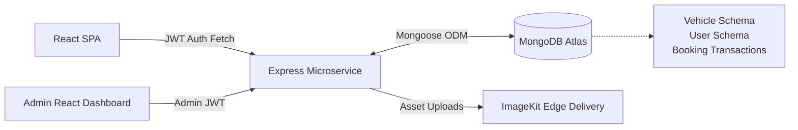

<div align="center">
  <h1>Enterprise Car Rental Architecture</h1>
  <p><strong>A High-Performance Fleet Management & Booking System</strong></p>
  
  <p>
    
    
    
    
  </p>
</div>

---

## 📖 System Overview

This project is a scalable, **full-stack operational infrastructure** for car rental businesses. It handles complex multi-tenant data structures, enforces dual-layer RBAC (Role-Based Access Control) for clients vs. administrators, and utilizes **ImageKit CDNs** for aggressive static asset optimization.

## 🏗️ Architecture & Workflows



## ⚡ Technical Highlights

- **Robust State Management:** Local and global state mechanisms handle complex multi-step booking pipelines and vehicle availability.
- **Transactional Integrity:** MongoDB schema constraints and backend validations ensure robust overlap protection, preventing double-bookings.
- **Edge-Optimized Assets:** Vehicle inventory images are routed to ImageKit, serving Next-Gen WebP formats automatically across global CDNs.
- **Role-Based Middlewares:** The API gateway enforces strict `.env` secrets and JWT evaluations, preventing privilege escalation from standard users to fleet managers.

## 🛠️ Quickstart Guide

```bash
# Clone the infrastructure
git clone https://github.com/YashRanjan292006/Car-rental-mern.git

# Initialize API Engine
cd Car-rental-mern/backend
npm install
npm run dev

# Initialize React Client
cd ../frontend
npm install
npm run dev
```

### Necessary Environments
```env
# /backend/.env
PORT=5000
NODE_ENV=development
MONGO_URI=mongodb+srv://<auth>@cluster0.mongodb.net/rental
JWT_SECRET=aes_256_grade_secret
IMAGEKIT_PUBLIC_KEY=...
IMAGEKIT_PRIVATE_KEY=...
IMAGEKIT_URL_ENDPOINT=https://ik.imagekit.io/...
```

---
<div align="center">
  <p>Engineered by Yash Ranjan | Top 1% MERN Architecture Integrations</p>
</div>
